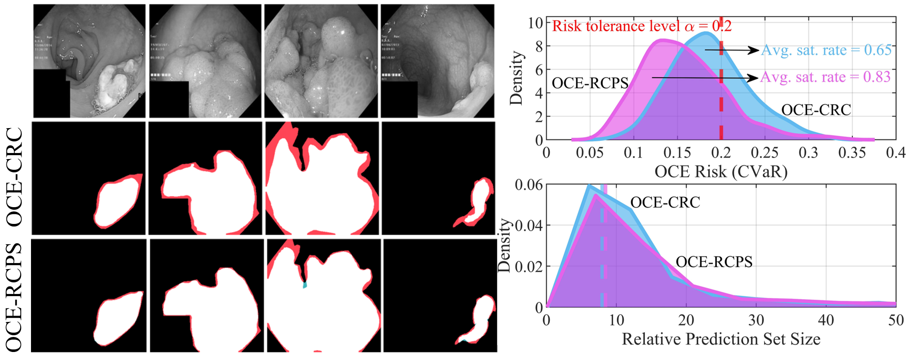

# Optimized Certainty Equivalent Risk-Controlling Prediction Sets

[](https://arxiv.org/pdf/2602.13660)
[](https://pytorch.org/)
[](https://github.com/torrvision/focal_calibration/blob/main/LICENSE)

This repository contains the code for [*Optimized Certainty Equivalent Risk-Controlling Prediction Sets*](https://arxiv.org/pdf/2602.13660), a framework that extends standard RCPS to handle general OCE risk measures such as CVaR (Conditional Value-at-Risk) and entropic risk. The method provides finite-sample, distribution-free guarantees on risk measures beyond the standard expected loss. Some elements are still in progress.

If the code or the paper has been useful in your research, please add a citation to our work:

```
@article{huang2026optimized,
  title={Optimized Certainty Equivalent Risk-Controlling Prediction Sets},
  author={Huang, Jiayi and Farzaneh, Amirmohammad and Simeone, Osvaldo},
  journal={arXiv preprint arXiv:2602.13660},
  year={2026}
}
```

## Summary

Figure: Given an input $x$, e.g., an image, and a pre-trained model $p(y|x)$, optimized certainty equivalent conformal risk control (OCE-CRC) and the proposed OCE risk-controlling prediction sets (OCE-RCPS) find a hyperparameter configuration $\hat{\lambda}$, e.g., an inclusion threshold, such that the reliability constraint $R_{\text{OCE}}(\hat{\lambda}) \leq \alpha$ is satisfied for any given OCE risk measure $R_{\text{OCE}}(\cdot)$, e.g., the conditional value-at-risk (CVaR). OCE-CRC ensures this condition only on average with respect to the calibration data used to optimize the hyperparameter $\lambda$. In contrast, OCE-RCPS ensures that the condition $R_{\text{OCE}}(\hat{\lambda}) \leq \alpha$ holds with probability no smaller than a target level $1-\delta$. The left panel of the figure shows representative results for the CVaR of the false negative rate (FNR) loss in a segmentation task, with white, red, and green pixels denoting correct predictions, false negatives, and false positives, respectively. The right panel of the figure compares the empirical distribution of the CVaR and of the relative prediction set size with targets $\alpha=0.2$ and $1-\delta=0.8$. While OCE-CRC yields hyperparameters $\hat{\lambda}$ violating the requirement $R_{\text{OCE}}(\hat{\lambda}) \leq \alpha$ with probability larger than the requirement $\delta=0.2$, the proposed OCE-RCPS meets the target satisfaction rate $1-\delta=0.8$.

## Repository Structure

```
.
├── core/
│   ├── bounds_oce.py            # Concentration bounds (WSR, HB) for OCE risk measures
│   └── concentration_oce.py     # UCB computation, t-candidate generation, lambda selection
├── risk_histogram_oce.py        # Main experiment runner and plotting
├── PraNet/
│   ├──process_all_datasets.py   # Inference script for generating predictions
│   ├──.cache/                   # Precomputed loss/size tables
├──outputs/                      # Experiment results and plots
```


## Dependencies

The code is based on PyTorch and requires a few common dependencies. It should work with newer versions as well.

## Data Preparation
(1) **Download datasets**: Place the polyp segmentation datasets under `./PraNet/data/TestDataset/`, including Kvasir, HyperKvasir, CVC-ClinicDB, CVC-ColonDB, and ETIS-LaribPolypDB, which can be found in this [link](https://drive.google.com/file/d/1Y2z7FD5p5y31vkZwQQomXFRB0HutHyao/view).

(2) **Download PraNet weights**: Place the pretrained model at `./PraNet/snapshots/PraNet_Res2Net/PraNet-19.pth`, downloaded from [link](https://drive.usercontent.google.com/download?id=1lJv8XVStsp3oNKZHaSr42tawdMOq6FLP&export=download&authuser=0).

(3) **Generate predictions**: One can ```python ./PraNet/process_all_datasets.py``` with the default settings, which runs ParNet inference on all datasets and saves inference results to target folder.

(4) **Precompute loss and size tables**: Generate `.npy` files containing per-sample losses and prediction set sizes for each lambda value, and place them in `./.cache/`.


## Conformal alignment-based (CAb) model cascading
In order to reproduce the results presented in this paper, one can run ```python ./risk_histogram_oce.py``` with different parameter settings as described below.

| Argument       | Type    | Default  | Description                                        |
|----------------|---------|----------|----------------------------------------------------|
| `--gamma`      | `float` | `0.2`    | Target risk level.                                 |
| `--delta`      | `float` | `0.2`    | Targer confidence parameter.                       |
| `--beta`       | `float` | `0.9`    | CVaR concentration level / entropic risk aversion. |
| `--bounds`     | `str`   | `'WSR'`  | Concentration bounds to use.                       |
| `--risk_types` | `str`   | `'cvar'` | Particular OCE risk measure.                       |

### Example usage
For instance, to obtain the presented results, i.e., [OCE-RCPS](overview.jpg), on the tumor segmentation dataset using a user-defined tolerated risk level $\alpha=0.2$, target satisfaction rate $1-\delta = 0.8$, and CVaR concentration level $\beta=0.9$, one can run the following command:
```
python ./CAb.py --gamma 0.2 --delta 0.2 --beta 0.9 --bounds 'WSR' --risk_types 'cvar'
```
By utilizing the inference results generated by the PraNet, this configuration reproduces the OCE-RCPS behavior under the specified settings. 

### Supported Risk Types

- `standard` — Standard RCPS with expected loss
- `cvar` — OCE-RCPS with CVaR risk (with UCB)
- `entropic` — OCE-RCPS with entropic risk (with UCB)
- `crc_cvar` — CRC baseline with CVaR risk (no UCB)
- `crc_entropic` — CRC baseline with entropic risk (no UCB)

### Supported Bounds

- `WSR` — WaudbySmith and Ramda UCB (SOTA, recommended)
- `HB` — Hoeffding UCB 


## Questions

If you have any questions or doubts, please feel free to open an issue in this repository or reach out to me at the provided email addresses: jiayi.3.huang@kcl.ac.uk .
